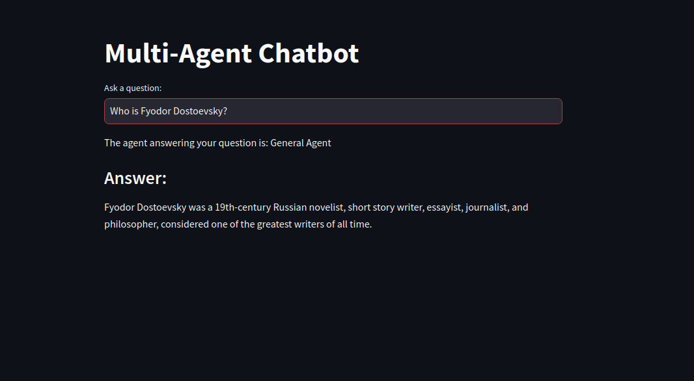

# MultiAgent Chatbot using LangChain and LangGraph

# Multi-Agent Chatbot

A multi-agent chatbot application that can analyze and answer questions based on the type of question it receives. It uses a decision-making graph to classify the question as one of the following types:

- **Technical (Code)**: Questions related to software development or coding.
- **General**: General knowledge or non-technical questions.
- **Arithmetic**: Basic arithmetic questions or calculations.
- **Research**: Questions related to research papers.

### Features

- **Question Classification**: The chatbot can identify whether the question is related to programming, general knowledge, arithmetic or research papers.
- **Answering Agent**: Based on the classification, the corresponding agent is invoked to answer the question:
  - Code Agent: Provides step-by-step answers to coding-related questions.
  - General Agent: Provides concise answers to general questions.
  - Arithmetic Agent: Evaluates and answers arithmetic questions.
  - Research Agent: Provides brief introduction to the queried research paper.

### Technology Stack

- **LangChain**: Used for language model chains and prompt templates.
- **LangChain-Groq**: Integration with Groq's language models.
- **LangGraph**: Used for creating a decision-making workflow to handle the question routing and decision logic.
- **Streamlit**: Used for UI development.


### Installation

   ```bash
   1. git clone https://github.com/pranzalkhadka/MultiAgent_Chatbot.git
   2. cd MultiAgent_Chatbot
   3. python3 -m venv venv
   4. source venv/bin/activate
   5. pip install -r requirements.txt
   6. Obtain your API key from Groq
   7. streamlit run app.py
```

### Sample Output

Here are some sample outputs from the chatbot application :-

1. **Generic Question**:
   

2. **Code Question**:
   
   

3. **Arithmetic Question**:
   

4. **Research Paper Question**:
   